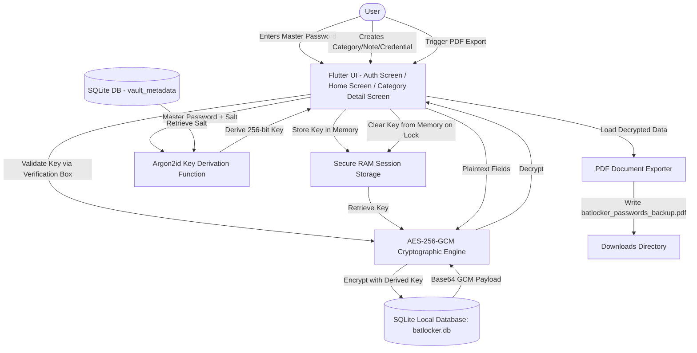

# 🦇 BatLocker

BatLocker is a secure, offline-first password manager featuring a striking cyberpunk terminal design system. Built with Flutter, it offers on-device encryption, customizable categories, a secure scratchpad/notes module, and local PDF backup generation.

---

## 🏗️ Architecture & Data Flow

Below is the diagram illustrating the architecture of **BatLocker**, showing the interactions between the UI, storage utilities, encryption engine, and native system containers.



---

## 📱 Application Modules & Features

| Module / Screen | Description | Underlying Component |
| :--- | :--- | :--- |
| **🛸 Cyberpunk Splash Screen** | A themed loading screen featuring boots sequences, scanning animations, and HUD rotations. | `SplashScreen` (with staggered animations, CustomPainters) |
| **🔒 Auth Gate** | Prevents unauthorized access. Prompts for Master Password setup on first boot or verification on subsequent starts. | `AuthScreen` (terminal boot UI, `LockerTextField`) |
| **📁 Category Management** | Organizes password records into custom-labeled and custom-imaged group cards. | `CategoryScreen` (handles SQLite CRUD for Categories) |
| **🔑 Credential Locker** | Stores titles, usernames, notes, and encrypted passwords. Supports marking entries as favorites. | `PasswordScreen` (handles SQLite CRUD, decryption/encryption wrappers) |
| **📝 Secure Notes** | A secondary database module for raw notes, keys, or non-login confidential information. | `Note` model, Notes dashboard and detail editor |
| **📄 PDF Backups** | Generates offline document logs of categories and credentials stored on the device. | `pdf` library, document builder with local file write |
| **⚙️ Terminal Settings** | System preferences area to update the Master Password, toggle Biometrics, or completely wipe the database. | Settings panels (`wipeDatabase()`, `flutter_secure_storage` updates) |

---

## 🛠️ Technical Stack & Implementation Details

| Component | Library / Tool | Implementation Detail |
| :--- | :--- | :--- |
| **Framework** | **Flutter (SDK >=3.0.0 <4.0.0)** | Cross-platform framework running natively on Android, iOS, Desktop, and Web. |
| **Database** | **`sqflite` (SQLite)** | Native local database binding for robust, relational structured storage. |
| **Secure Key Store**| **`flutter_secure_storage`** | Stores the Master Password using OS-level secure storage APIs. |
| **Cryptographics** | **`encrypt` (PointyCastle)** | Performs AES-128 cryptographic operations on password strings. |
| **Storage Helper** | **`path_provider`** | Accesses sandboxed system directories and user directories (e.g. Downloads). |
| **Fonts & Styles** | **`google_fonts`** | Loads specialized typefaces like `JetBrains Mono` and `Anton` dynamically. |
| **Document Engine**| **`pdf`** | Programmatically creates multi-page PDF documents for data backup. |

---

## 🔒 Security & Data Storage Deep Dive

### 1. On-Device Storage Layout
All data is stored **100% locally** within the app sandbox. There are no remote connections, telemetry SDKs, or cloud endpoints utilized.

```
Device File System
 ├── 📄 Local Database (batlocker.db) -> [SQLite Sandbox]
 │    ├── Categories Table (Cleartext Metadata)
 │    ├── Passwords Table (Encrypted Columns: Title, Username, Password, Notes)
 │    ├── Notes Table (Encrypted Columns: Title, Content)
 │    └── Vault Metadata Table (Cleartext Salt, Encrypted Verification Block)
 ├── 🔑 Secure Storage -> [Keystore (Android) / Keychain (iOS)] (No Master Password stored!)
 └── 📥 Backup Storage -> [Downloads Folder]
      └── batlocker_passwords_backup.pdf
```

### 2. Device Path Directory Specifications
Depending on the platform the app is running on, files are stored in the following sandboxed locations:

| OS Platform | Storage Type | Default System Path |
| :--- | :--- | :--- |
| **Android** | SQLite DB (`sqflite`) | `/data/data/com.example.bat_locker/databases/batlocker.db` |
| | Exports | App-specific external storage: `Android/data/com.example.bat_locker/files/batlocker_passwords_backup.pdf` |
| **iOS** | SQLite DB (`sqflite`) | `/var/mobile/Containers/Data/Application/<App_UUID>/Library/LocalDatabase/batlocker.db` |
| | Exports | Sandboxed Documents Directory: `batlocker_passwords_backup.pdf` |

### 3. Database Schema Layout

#### **`vault_metadata` Table**
Holds critical metadata for key verification and derivation.
| Column | Type | Constraints | Purpose |
| :--- | :--- | :--- | :--- |
| `id` | `INTEGER` | `PRIMARY KEY AUTOINCREMENT` | Unique metadata entry ID |
| `salt` | `TEXT` | `NOT NULL` | Base64-encoded random 32-byte Argon2id salt |
| `verification_box` | `TEXT` | `NOT NULL` | Encrypted dynamic block verification payload |

#### **`categories` Table**
Holds structural category metadata.
| Column | Type | Constraints | Purpose |
| :--- | :--- | :--- | :--- |
| `id` | `INTEGER` | `PRIMARY KEY AUTOINCREMENT` | Unique category identifier |
| `name` | `TEXT` | `NOT NULL UNIQUE` | Category label |
| `image_path` | `TEXT` | `NULLABLE` | Local asset/file path for category logo |

#### **`passwords` Table**
Holds credential records. The title, username, password, and notes columns are fully encrypted.
| Column | Type | Constraints | Purpose |
| :--- | :--- | :--- | :--- |
| `id` | `INTEGER` | `PRIMARY KEY AUTOINCREMENT` | Unique password record identifier |
| `category_id` | `INTEGER` | `FOREIGN KEY` references `categories(id)` | Cascaded on delete |
| `title` | `TEXT` | `NOT NULL` | **AES-256-GCM Encrypted** visual label |
| `username` | `TEXT` | `NOT NULL` | **AES-256-GCM Encrypted** account username/email |
| `password` | `TEXT` | `NOT NULL` | **AES-256-GCM Encrypted** security credential |
| `notes` | `TEXT` | `NULLABLE` | **AES-256-GCM Encrypted** metadata comment |
| `image_path` | `TEXT` | `NULLABLE` | Optional card decoration image |
| `is_favorite` | `INTEGER` | `DEFAULT 0` | 1 if starred/favorite, 0 otherwise |

#### **`notes` Table**
Holds secure raw textual records. Title and content columns are fully encrypted.
| Column | Type | Constraints | Purpose |
| :--- | :--- | :--- | :--- |
| `id` | `INTEGER` | `PRIMARY KEY AUTOINCREMENT` | Unique note identifier |
| `title` | `TEXT` | `NOT NULL` | **AES-256-GCM Encrypted** note title |
| `content` | `TEXT` | `NOT NULL` | **AES-256-GCM Encrypted** note content |
| `created_at` | `TEXT` | `NOT NULL` | ISO timestamp |

---

## 🔑 Cryptography & Encryption Strategy

> [!IMPORTANT]
> BatLocker implements a strict **Zero-Knowledge Security Model**. No encryption key, database key, or master password is ever cached on disk, hardcoded, or stored permanently. All cryptographic operations are performed on-the-fly and keys are held solely in RAM during active sessions.

### Cryptographic Stack:
- **Key Derivation (Argon2id)**:
  - When the vault is created, a unique, cryptographically secure 32-byte salt is generated.
  - When unlocking, the user's master password and salt are processed through **Argon2id** (configured with `15 MB` memory-hardness, `2` iterations, and `1` thread) to derive a secure 256-bit symmetric key.
- **Authenticated Encryption (AES-256-GCM)**:
  - Standardized authenticated encryption (GCM) ensures ciphertext integrity and prevents tampering.
  - Every encrypted string contains:
    - `96-bit (12-byte)` randomly generated unique initialization vector (Nonce).
    - `128-bit (16-byte)` authenticated integrity verification tag (MAC tag).
    - Varying length ciphertext.
  - The payload is formatted as a single concatenated byte array: `[Nonce (12B)] + [MAC Tag (16B)] + [Ciphertext]` and base64-encoded for database storage.

```
Encryption Pathway (AES-256-GCM):
Plaintext Variable ──> [ Symmetrical AES-256-GCM Engine ] ──> Concatenated Payload ──> Base64 Encoding ──> SQLite DB
                         ▲
                         │ (Key derived dynamically via Argon2id)
                    [ Derived Key ] (RAM only)

Decryption Pathway (AES-256-GCM):
Read Ciphertext ──> Base64 Decode ──> Extract Nonce & Tag ──> [ Symmetrical Decryption Engine ] ──> Plaintext (RAM only)
```

---

## 🎨 Theme & Styling Design System

BatLocker features a customized Dark/Crimson sci-fi terminal layout. The design relies on the following palette:

* **Crimson Red (`#8B0000`)** - Primary branding, buttons, errors, active scans.
* **Gold (`#D4AF37`)** - Accent colors, highlights, stars/favorites indicator.
* **Dark Gray (`#1A1A1A`)** - Card background fills, terminal headers, modal boxes.
* **Medium Gray (`#A0A0A0`)** - Secondary labels, terminal details, body texts.
* **Near Black (`#0D0D0D`)** - Core application background (Scaffold background).
